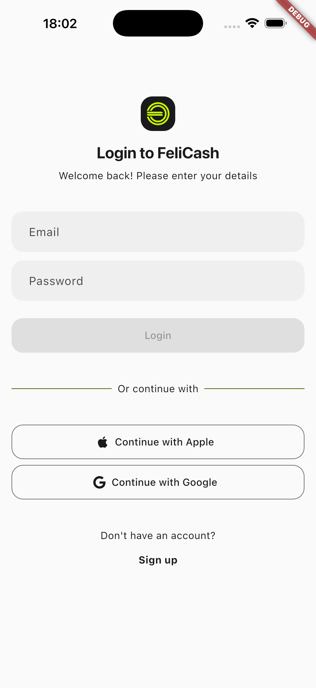
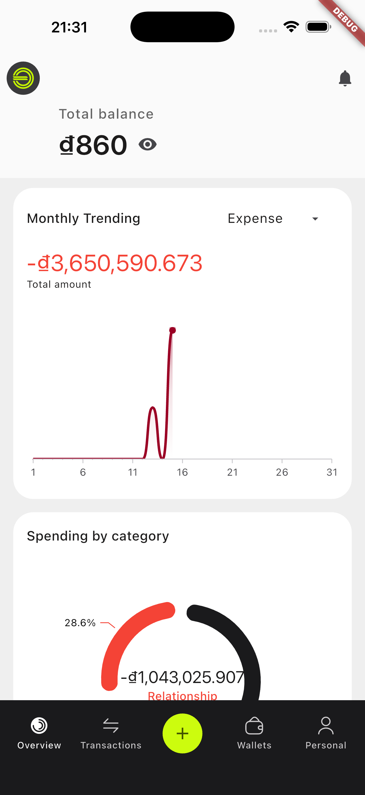
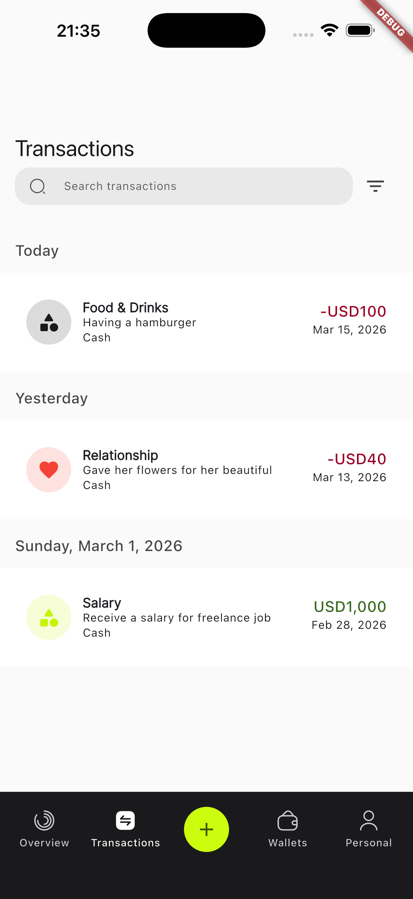
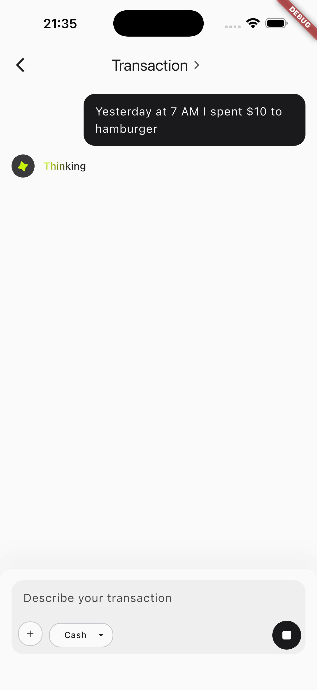
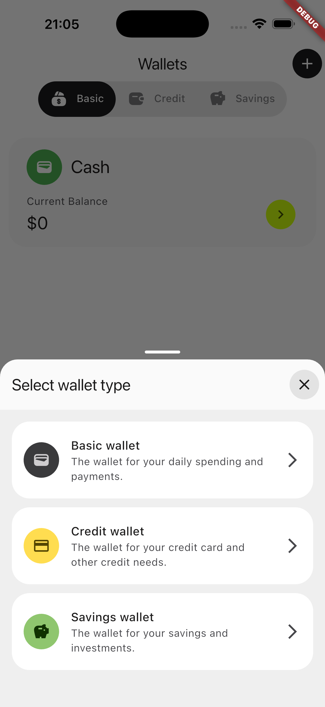
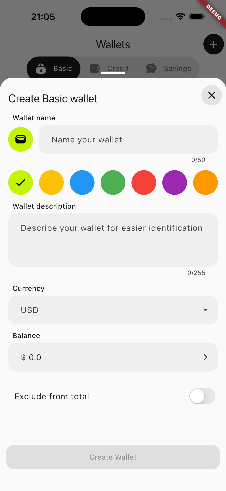

<p align="center">
  
</p>

<h1 align="center">FeliCash</h1>

<p align="center">
  <strong>AI-Powered Money Tracker Application</strong>
</p>

<p align="center">
  
  <a href="https://pub.dev/packages/very_good_analysis">
    
  </a>
  <a href="https://opensource.org/licenses/MIT">
    
  </a>
  <a href="https://flutter.dev">
    
  </a>
</p>

<p align="center">
  <a href="#features">Features</a> •
  <a href="#screenshots">Screenshots</a> •
  <a href="#getting-started">Getting Started</a> •
  <a href="#architecture">Architecture</a> •
  <a href="#contributing">Contributing</a> •
  <a href="#license">License</a>
</p>

---

## 🚀 Features

FeliCash is a comprehensive personal finance management application with AI-powered capabilities:

### 💰 Wallet Management
- **Bank Wallets** - Track digital bank accounts, deposits, and withdrawals
- **Cash Wallets** - Monitor physical cash transactions
- **Credit Card Wallets** - Manage credit card spending, limits, and due dates
- **Savings Wallets** - Set financial goals and track savings progress

### 📝 Transaction Management
- **Manual Entry** - Create transactions with notes, images, timestamps, and locations
- **Voice Transactions** - Create transactions using voice commands with AI/LLM extraction
- **Multi-Currency Support** - Automatic currency conversion with real-time exchange rates
- **Transaction Categorization** - Income, Expense, and Transfers

### 🤖 AI Assistant
- **Natural Language Queries** - Ask questions about your finances in plain English
- **Voice Commands** - Hands-free transaction creation and queries
- **Smart Reports** - AI-generated financial insights and summaries
- **Text-to-Speech** - Listen to your financial reports

### 📊 Analytics & Reports
- **Spending by Category** - Visual breakdown of expenses with pie charts
- **Monthly Trending** - Track income, expenses, and transfers over time
- **Custom Date Ranges** - Flexible reporting periods
- **Total Balance Overview** - Real-time financial health monitoring

### 🔐 Authentication
- **Social Login** - Google and Apple authentication
- **Email/Password** - Traditional authentication
- **Secure Logout** - Safe session management
- **Multi-environment** - Development, Staging, and Production flavors

### 🌍 Internationalization
- **Multi-language Support** - English and Vietnamese (extensible)
- **Currency Localization** - Support for multiple global currencies

---

## 📸 Screenshots

A quick visual tour of key user flows. Click any screenshot to view full size.

### Authentication

| Login |
|---|
| [](docs/screenshots/login_screen.png) |

### Overview & Transactions

| Dashboard | Transaction List | AI Transaction Record |
|---|---|---|
| [](docs/screenshots/dashboard_screen.png) | [](docs/screenshots/transaction_list_screen.png) | [](docs/screenshots/ai_transaction_record.png) |

### Wallets

| Wallet Type Selection | Wallet Creation Form |
|---|---|
| [](docs/screenshots/wallet_creation_type_select.png) | [](docs/screenshots/wallet_creation_form.png) |

---

## 🏗️ Architecture

FeliCash follows a **modular monorepo architecture** using [Melos](https://melos.invertase.dev/) for package management:

```
├── lib/                          # Main application code
│   ├── app/                      # App-level configuration (routes, blocs)
│   │   ├── app.dart             # App exports
│   │   ├── bloc/                # Global BLoCs
│   │   ├── routes/              # Routing configuration (go_router)
│   │   └── view/                # App view
│   ├── ai_assistant/             # AI chatbot and voice features
│   ├── category/                 # Category management
│   ├── currency/                 # Currency selection and management
│   ├── home/                     # Home screen
│   ├── login/                    # Authentication screens
│   ├── navigation/               # Bottom navigation
│   ├── onboarding/               # Onboarding flow
│   ├── overview/                 # Dashboard and analytics
│   ├── personal/                 # User profile and settings
│   ├── transaction/              # Transaction CRUD operations
│   ├── user_setting/             # User settings
│   ├── voice_transaction/        # Voice-based transaction creation
│   ├── wallet/                   # Wallet management
│   ├── wallet_creation/          # Wallet creation flows
│   └── main/                     # Entry points
│
├── packages/                     # Modular packages
│   ├── app_ui/                   # UI components and themes
│   ├── app_utils/                # Utility functions and extensions
│   ├── form_inputs/              # Form validation and input handling
│   ├── shared_models/            # Shared data models and enums
│   ├── clients/                  # External service clients
│   │   ├── ai_client/            # AI client abstractions
│   │   │   ├── ai_client/        # Base AI client
│   │   │   └── n8n_ai_client/    # n8n workflow AI client
│   │   ├── authentication_client/ # Auth clients
│   │   │   ├── authentication_client/
│   │   │   ├── supabase_authentication_client/
│   │   │   └── token_storage/
│   │   ├── dio_client/           # HTTP client
│   │   ├── felicash_data_client/ # Data layer client (PowerSync + Supabase)
│   │   ├── felicash_storage_client/ # Storage client
│   │   ├── permission_client/    # Device permissions
│   │   ├── speech_to_text_client/ # Speech recognition
│   │   └── text_to_speech_client/ # Text-to-speech
│   └── repositories/             # Data repositories
│       ├── category_repository/
│       ├── currency_repository/
│       ├── recurrence_repository/
│       ├── transaction_repository/
│       ├── user_repository/
│       ├── user_setting_repository/
│       └── wallet_repository/
│
├── android/                      # Android-specific configuration
├── ios/                          # iOS-specific configuration
├── web/                          # Web configuration
├── macos/                        # macOS configuration
└── windows/                      # Windows configuration
```

### Tech Stack

| Layer | Technology |
|-------|------------|
| **Framework** | Flutter 3.5+ |
| **State Management** | Flutter Bloc (BLoC pattern) |
| **Backend** | Supabase (PostgreSQL + Auth) |
| **Offline Sync** | PowerSync |
| **AI/ML** | n8n Workflows + LLM Integration |
| **Speech Recognition** | speech_to_text |
| **Charts** | Syncfusion Flutter Charts |
| **Routing** | go_router |
| **Dependency Injection** | flutter_bloc RepositoryProvider |
| **Code Generation** | freezed, json_serializable |
| **Monorepo** | Melos |

---

## 🚀 Getting Started

### Prerequisites

- **Flutter SDK** ^3.5.0
- **Dart SDK** ^3.5.0
- **Melos** (for monorepo management)
- **Firebase CLI** (for Firebase configuration)
- **Supabase Account** (for backend) - [Create free account](https://supabase.com)

### Backend Services Setup

Before running the app, you'll need to set up:

1. **Supabase Project** - See [Self-Hosting Guide](docs/SELF_HOSTING.md) for detailed instructions
2. **Firebase Project** - For push notifications and analytics
3. **PowerSync** (optional) - For offline-first sync capabilities
4. **n8n** (optional) - For AI workflow automation

> **Quick Start:** You can run the app with just Supabase configured. Other services are optional for basic functionality.

### Installation

1. **Clone the repository**
   ```bash
   git clone https://github.com/quimblelabs/felicash-app.git
   cd felicash-app
   ```

2. **Install Melos**
   ```bash
   dart pub global activate melos
   ```

3. **Bootstrap the monorepo**
   ```bash
   melos bootstrap
   ```

4. **Install dependencies**
   ```bash
   flutter pub get
   ```

5. **Configure Firebase**
   ```bash
   # Run the Firebase configuration script
   ./flutterfire-config.sh
   ```

6. **Configure Environment Variables**
   
   FeliCash uses `--dart-define-from-file` to manage environment-specific configurations and API keys.
   
   a. Copy the example configuration file:
   ```bash
   cp configurations.example.json configurations.dev.json
   cp configurations.example.json configurations.stg.json
   cp configurations.example.json configurations.prod.json
   ```
   
   b. Edit each configuration file with your actual API keys:
   
   | Variable | Description | Required |
   |----------|-------------|----------|
   | `SUPABASE_URL` | Your Supabase project URL | ✅ |
   | `SUPABASE_ANON_KEY` | Supabase anonymous key | ✅ |
   | `FELICASH_LOCAL_DB_NAME` | Local SQLite database name | ✅ |
   | `N8N_BASE_URL` | n8n webhook base URL | ⚠️ (for AI features) |
   | `ELEVENLABS_BASE_URL` | ElevenLabs API base URL | ⚠️ (for TTS) |
   | `ELEVENLABS_API_KEY` | ElevenLabs API key | ⚠️ (for TTS) |
   | `OPENAI_BASE_URL` | OpenAI API base URL | ⚠️ (for AI features) |
   | `OPENAI_API_KEY` | OpenAI API key | ⚠️ (for AI features) |
   | `POWERSYNC_URL` | PowerSync sync URL | ⚠️ (for offline sync) |
   | `IOS_CLIENT_ID` | Google Sign-In iOS client ID | ⚠️ (for iOS) |
   | `WEB_CLIENT_ID` | Google Sign-In web client ID | ⚠️ (for web) |
   | `TEST_USER_ID` | Test user ID for development | ⚠️ (optional) |
   
   > **Note:** Configuration files (`configurations.*.json`) are gitignored for security. Never commit files containing real API keys!

### Running the App

FeliCash supports three flavors: **development**, **staging**, and **production**.

#### Using VS Code / Android Studio

Update your `.vscode/launch.json` to include the `--dart-define-from-file` argument:

```json
{
  "version": "0.2.0",
  "configurations": [
    {
      "name": "FeliCash (Development)",
      "request": "launch",
      "type": "dart",
      "program": "lib/main/main_development.dart",
      "args": [
        "--flavor", "development",
        "--dart-define-from-file", "configurations.dev.json"
      ]
    },
    {
      "name": "FeliCash (Staging)",
      "request": "launch",
      "type": "dart",
      "program": "lib/main/main_staging.dart",
      "args": [
        "--flavor", "staging",
        "--dart-define-from-file", "configurations.stg.json"
      ]
    },
    {
      "name": "FeliCash (Production)",
      "request": "launch",
      "type": "dart",
      "program": "lib/main/main_production.dart",
      "args": [
        "--flavor", "production",
        "--dart-define-from-file", "configurations.prod.json"
      ]
    }
  ]
}
```

#### Using Command Line

```bash
# Development
flutter run --flavor development --target lib/main/main_development.dart --dart-define-from-file configurations.dev.json

# Staging
flutter run --flavor staging --target lib/main/main_staging.dart --dart-define-from-file configurations.stg.json

# Production
flutter run --flavor production --target lib/main/main_production.dart --dart-define-from-file configurations.prod.json
```

### Build for Release

```bash
# Android APK
flutter build apk --flavor production --target lib/main/main_production.dart --dart-define-from-file configurations.prod.json

# Android App Bundle
flutter build appbundle --flavor production --target lib/main/main_production.dart --dart-define-from-file configurations.prod.json

# iOS
flutter build ios --flavor production --target lib/main/main_production.dart --dart-define-from-file configurations.prod.json
```

---

## 🧪 Testing

### Run Tests

```bash
# Run all tests with coverage
flutter test --coverage --test-randomize-ordering-seed random

# Run tests for a specific package
cd packages/app_ui && flutter test --coverage
```

### View Coverage Report

```bash
# Generate HTML coverage report
genhtml coverage/lcov.info -o coverage/

# Open coverage report
open coverage/index.html
```

---

## 🌐 Internationalization

FeliCash uses Flutter's built-in internationalization support.

### Adding Translations

1. Add strings to `lib/l10n/arb/app_en.arb` (and other locale files)
2. Run code generation:
   ```bash
   flutter gen-l10n --arb-dir="lib/l10n/arb"
   ```

### Supported Locales

- 🇺🇸 English (`en`)
- 🇻🇳 Vietnamese (`vi`)

---

## 🤝 Contributing

We welcome contributions! Please see our [Contributing Guide](CONTRIBUTING.md) for details.

### Quick Start for Contributors

1. Fork the repository
2. Create a feature branch (`git checkout -b feature/amazing-feature`)
3. Commit your changes (`git commit -m 'Add amazing feature'`)
4. Push to the branch (`git push origin feature/amazing-feature`)
5. Open a Pull Request

Please ensure your code follows our style guidelines by running:

```bash
# Format code
dart format .

# Analyze code
flutter analyze

# Run tests
flutter test
```

---

## 📋 Roadmap

- [ ] Budget Planning with spending limits
- [ ] Lending & Borrowing tracking with reminders
- [ ] Scheduled transactions with notifications
- [ ] Recurring transactions UI
- [ ] Receipt scanning (OCR)
- [ ] Export reports to PDF/CSV
- [ ] Dark mode support
- [ ] Biometric authentication
- [ ] Widget support for home screen
- [ ] Apple Watch companion app

---

## 📚 Documentation

- [Architecture Overview](docs/ARCHITECTURE.md)
- [Contributing Guide](CONTRIBUTING.md)
- [API Documentation](docs/API.md)
- [Self-Hosting Guide](docs/SELF_HOSTING.md)
- [Features](docs/FEATURES.md)
- [UI Design (Figma)](https://www.figma.com/design/BxGc6bfunQ4W2QnbA429wQ/FeliCash---Personal-Money-Tracker?node-id=0-1&t=pffPeUa6Ag8vLt2X-1)

---

## 🔒 Security

For security concerns, please email
[huynhmytuan.dev@gmail.com](mailto:huynhmytuan.dev@gmail.com)
instead of using the public issue tracker.

---

## 📄 License

This project is licensed under the MIT License - see the [LICENSE](LICENSE) file for details.

---

## 🙏 Acknowledgments

- [Very Good Ventures](https://verygood.ventures) for the [Very Good CLI](https://github.com/VeryGoodOpenSource/very_good_cli) and [Very Good Analysis](https://pub.dev/packages/very_good_analysis)
- [Flutter Team](https://flutter.dev) for the amazing framework
- [Supabase](https://supabase.com) for the open-source Firebase alternative
- [Syncfusion](https://www.syncfusion.com) for the charting library
- All [contributors](https://github.com/quimblelabs/felicash-app/graphs/contributors) who have helped this project grow

---

<p align="center">
  Made with ❤️ by the FeliCash Team
</p>

<p align="center">
  <a href="https://github.com/quimblelabs/felicash-app">GitHub</a> •
  <a href="https://github.com/quimblelabs/felicash-app/discussions">Discussions</a>
</p>
